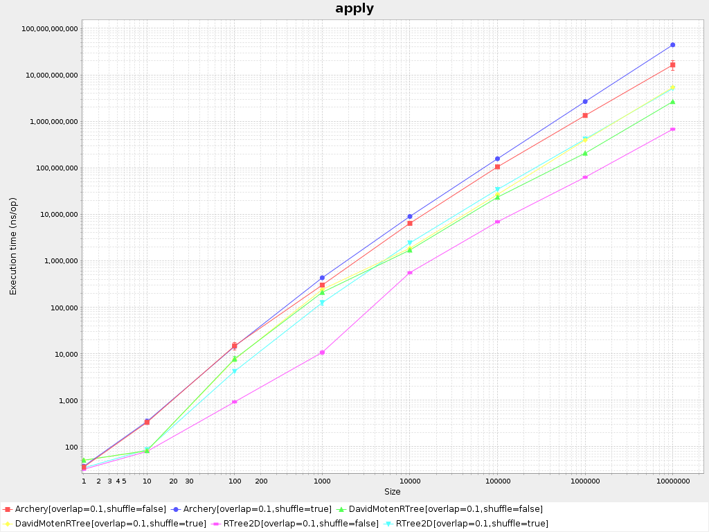
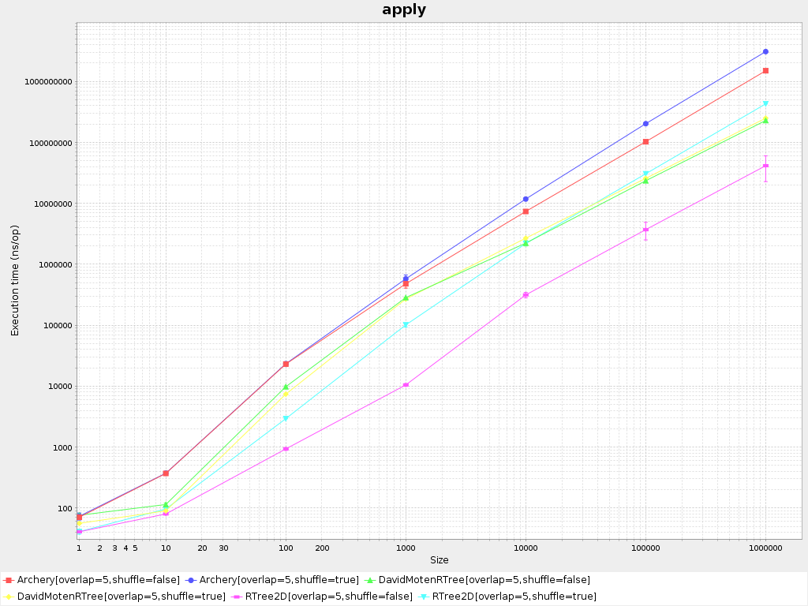
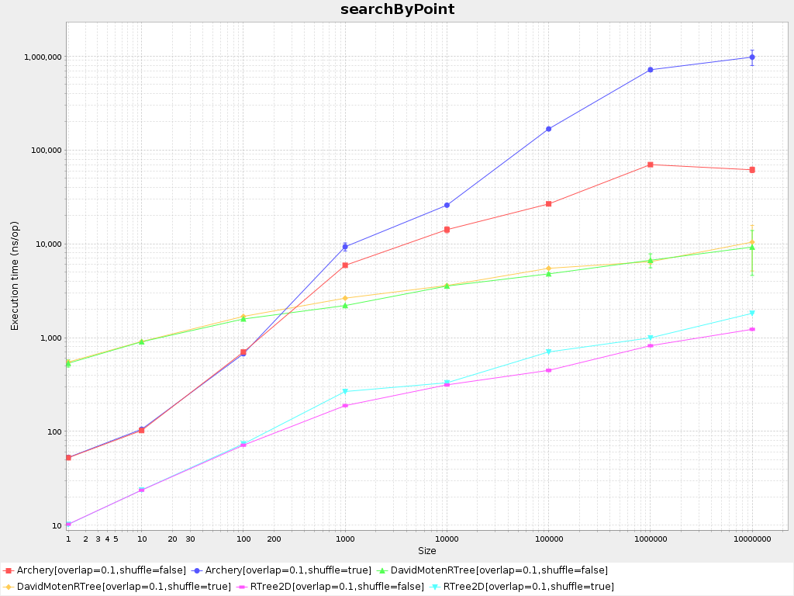
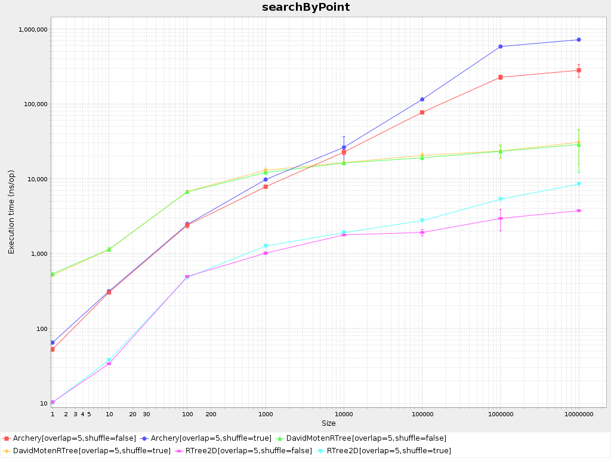

# RTree2D

[](https://travis-ci.com/Sizmek/rtree2d)
[](https://codecov.io/gh/Sizmek/rtree2d)

RTree2D is a 2D immutable [R-tree](https://en.wikipedia.org/wiki/R-tree) with 
[STR (Sort-Tile-Recursive)](https://archive.org/details/DTIC_ADA324493) packing.

## Goals

Main our requirements was:
- efficiency: we wanted the R-Tree to be able to search millions of points efficiently even in case of highly overlapped 
entries, also, we needed to be able to quickly rebuild R-tries with a per minute rate producing minimum pressure on GC
- immutability: different threads needed to be able to work with the same R-tree without problems, 
at the same time some thread can build a new version of the R-tree reusing immutable entries from the previous version

To archive these goals we have used:
- STR packing that is a one of the most efficient packing method which produces balanced R-tree for the specified 
sequence of entries
- a memory representation and access patterns to it which are aware of a cache hierarchy of contemporary CPUs (while it 
is not a final version and can be improved further soon)
- efficient implementations of search functions with minimum of virtual calls and allocations (there are versions with 
zero allocations)

## How to use

The library is published to JCenter, so please add a resolver for it in your `build.sbt` file or ensure that it is 
already added:

```sbt
resolvers += Resolver.jcenterRepo
```

Add the library to a dependency list:

```sbt
libraryDependencies += "com.sizmek.rtree2d" %% "core" % "0.1.0"
 ```

Entries of R-tree are represented by `RTreeEntry` instances which contains payload and 4 coordinates of the minimum 
bounding rectangle (MBR) for it.

Add import, create entries, build an R-tree from them, and use it for search by point or rectangle requests:

```scala
import com.sizmek.rtree2d.core._

val poi1 = RTreeEntry(1.0f, 1.0f, 2.0f, 2.0f, "point of interest 1")
val poi2 = RTreeEntry(2.0f, 2.0f, 3.0f, 3.0f, "point of interest 2")
val entries = Seq(poi1, poi2)

val rtree = RTree(entries)

assert(rtree.entries == entries)
assert(rtree.searchAll(0.0f, 0.0f) == Nil)
assert(rtree.searchAll(1.5f, 1.5f) == Seq(poi1))
assert(rtree.searchAll(2.5f, 2.5f) == Seq(poi2))
assert(rtree.searchAll(1.5f, 1.5f, 2.5f, 2.5f).forall(entries.contains))
```

Please, check out
[Scala docs in sources](https://github.com/Sizmek/rtree2d/blob/master/core/src/main/scala/com/sizmek/rtree2d/core/RTree.scala) 
and [tests](https://github.com/Sizmek/rtree2d/blob/master/core/src/test/scala/com/sizmek/rtree2d/core/RTreeTest.scala).
for other functions which allows no allocations and fast exit from search requests. 

## How it works

Charts below are latest results of benchmarks which compare RTree2D with [Archery](https://github.com/non/archery) and
[David Monten's rtree](https://github.com/davidmoten/rtree) libraries using JDK 8 on the following environment: 
Intel® Core™ i7-7700HQ CPU @ 2.8GHz (max 3.8GHz), RAM 16Gb DDR4-2400, Ubuntu 18.04, latest versions of Oracle JDK 8.

Main metric tested by benchmarks is an execution time in nanoseconds. So lesser values are better. Please, check out 
the Run benchmarks section bellow how to test other metrics like allocations in bytes or number of some CPU events.     

Benchmarks have the following parameters:
- `size` is a number of entries in the R-tree
- `shuffle` is a flag to turn on/off shuffling of entries before R-tree building
- `overlap` is a size of entries relative to interval between them 

The `apply` benchmark test building of R-tries from a sequence of entires.

No overlapping of entries (`overlap` = 0.1):

[](docs/overlap-0.1/apply.png)

Entries with lot of overlaps (`overlap` = 5):

[](docs/overlap-5/apply.png)

The `searchByPoint` benchmark test requests that search entries with intersects with the specified point.

No overlapping of entries (`overlap` = 0.1):

[](docs/overlap-0.1/searchByPoint.png)

Entries with lot of overlaps (`overlap` = 5):

[](docs/overlap-5/searchByPoint.png)

Other benchmarks tests searching by rectangles, returning entries back from R-tries, inserting and removing bulk of 
entries to/from them.

Charts with their results are available in subdirectories of the [docs](docs/) directory.  

## How to contribute

### Build

To compile, run tests, check coverage for different Scala versions use a command:

```sh
sbt clean +coverage +test +coverageReport +mimaReportBinaryIssues
```

### Run benchmarks

Benchmarks are developed in the separated module using [Sbt plugin](https://github.com/ktoso/sbt-jmh)
for [JMH tool](http://openjdk.java.net/projects/code-tools/jmh/). 

Feel free to modify benchmarks and check how it works with your data, JDK, and Scala versions.

To see throughput with allocation rate run benchmarks with GC profiler using the following command:

```sh
sbt -no-colors clean 'benchmark/jmh:run -prof gc -rf json -rff rtries.json .*'
```

It will save benchmark report in `benchmark/rtries.json` file.

Results that are stored in JSON can be easy plotted in [JMH Visualizer](http://jmh.morethan.io/) by drugging & dropping
of your file(s) to the drop zone or using the `source` or `sources` parameters with an HTTP link to your file(s) in the 
URLs: `http://jmh.morethan.io/?source=<link to json file>` or `http://jmh.morethan.io/?sources=<link to json file1>,<link to json file2>`.

Also, there is an ability to run benchmarks and visualize results with a `charts` command. It adds `-rf` and `-rff` 
options to all passes options and supply them to `jmh:run` task, then group results per benchmark and plot main score 
series to separated images. Here is an example how it can be called for specified version of JVM, value of the `overlap`
parameter, and patterns of benchmark names:

```sh
sbt 'charts -jvm /usr/lib/jvm/java-8-oracle/bin/java -p overlap=0.1 .*apply.* .*search.*'
```

Results will be places in a cross-build suffixed subdirectory of the `benchmark/target` directory in `*.png` files:
```sh
$ ls benchmark/target/scala-2.12/*.*n*

benchmark/target/scala-2.12/apply.png
benchmark/target/scala-2.12/searchByPoint.png
benchmark/target/scala-2.12/benchmark.json
``` 

### Publish locally

Publish to local Ivy repo:

```sh
sbt publishLocal
```

Publish to local Maven repo:

```sh
sbt publishM2
```

### Release

For version numbering use [Recommended Versioning Scheme](http://docs.scala-lang.org/overviews/core/binary-compatibility-for-library-authors.html#recommended-versioning-scheme)
that is used in the Scala ecosystem.

Double check binary and source compatibility, including behavior, and release using the following command (credentials 
are required):

```sh
sbt release
```

Do not push changes to github until promoted artifacts for the new version are not available for download on 
[jCenter](http://jcenter.bintray.com/com/sizmek/rtree2d/core_2.12/) to avoid binary compatibility check failures in 
triggered Travis CI builds. 
