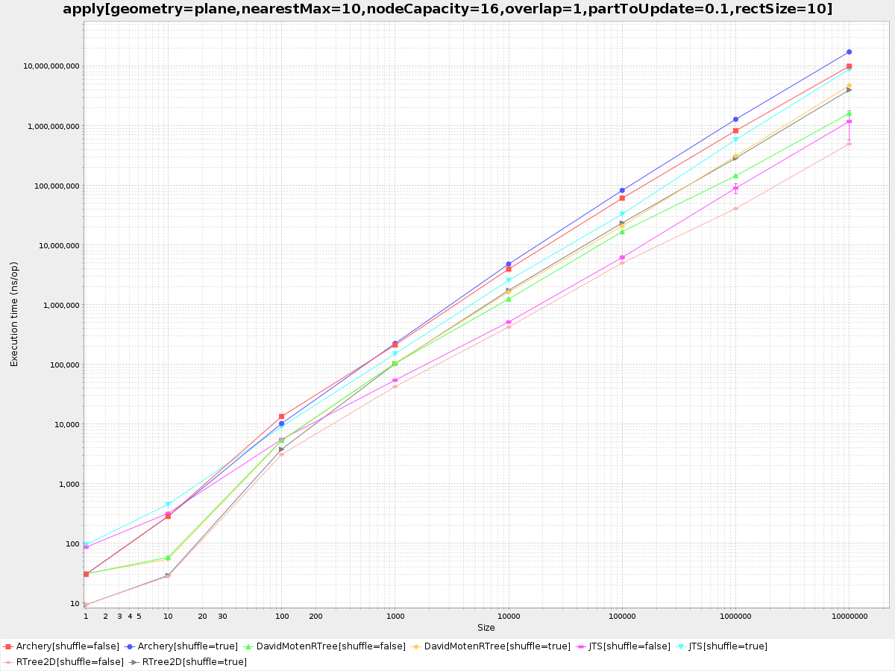
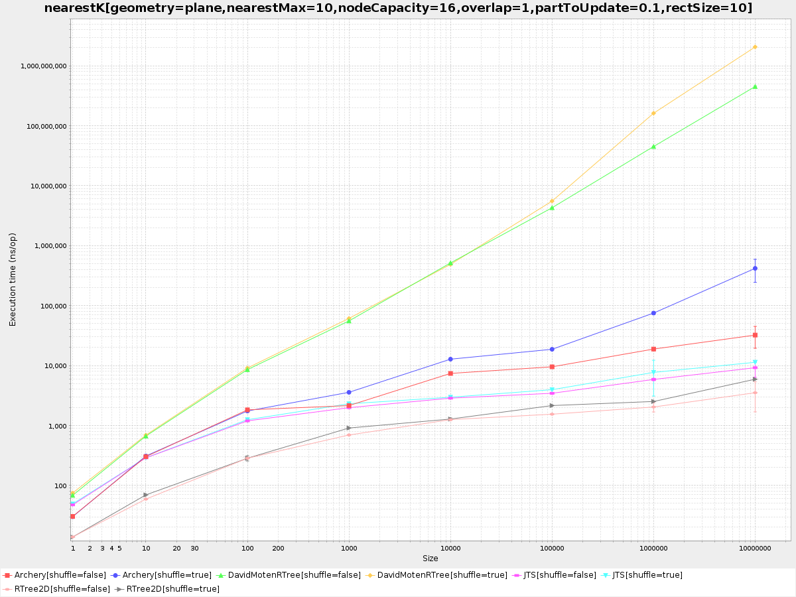
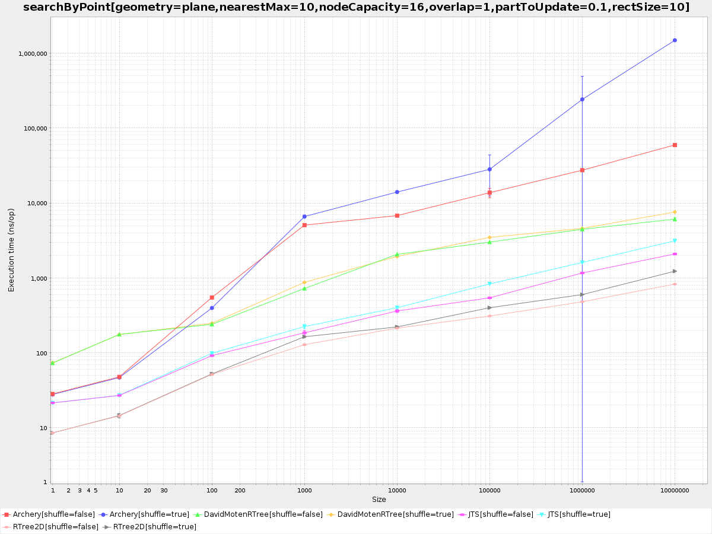
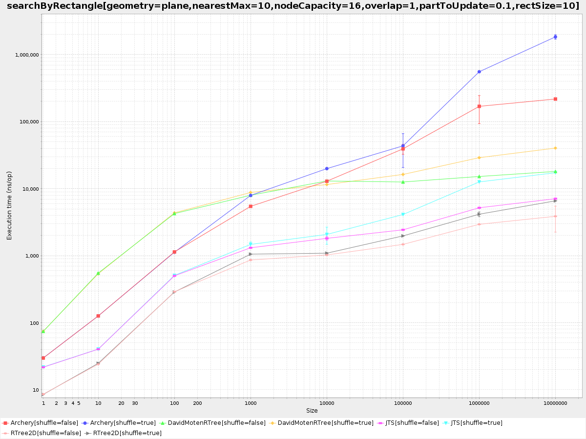
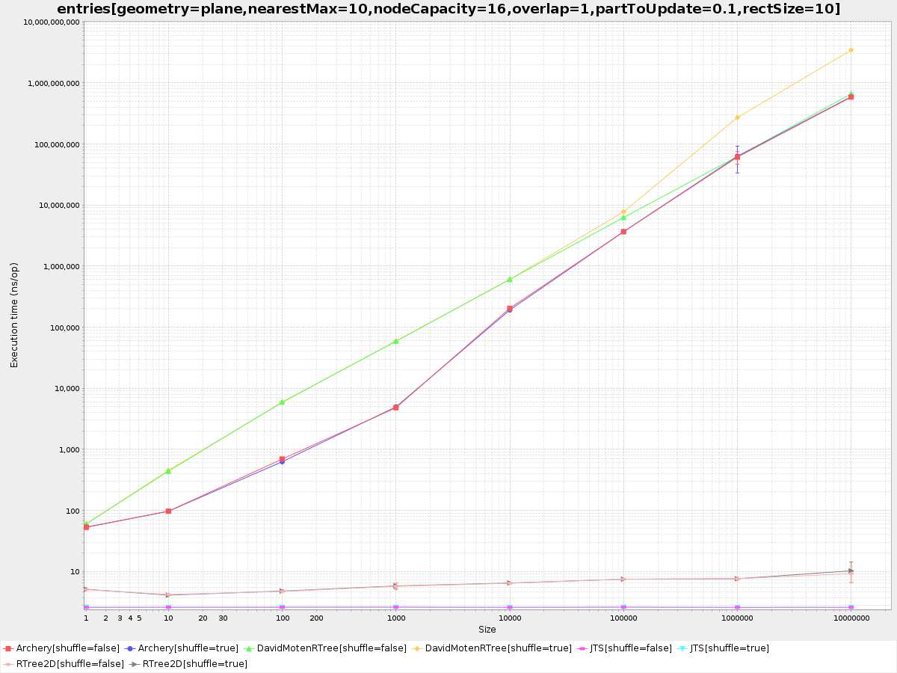
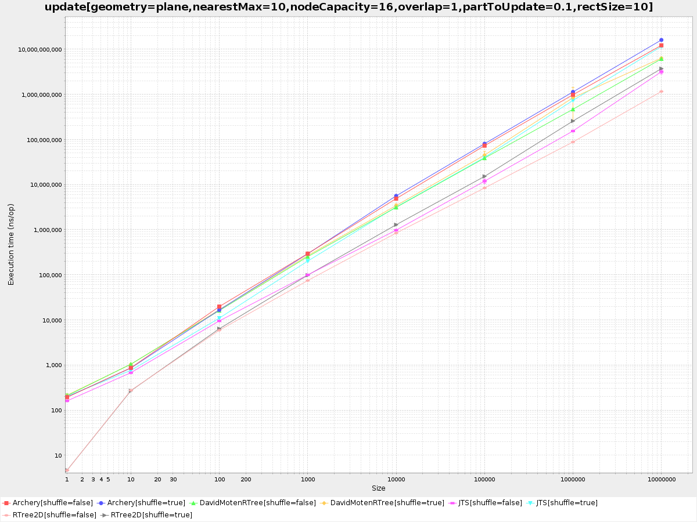

# RTree2D

[](https://github.com/plokhotnyuk/rtree2d/actions)
[](https://travis-ci.org/plokhotnyuk/rtree2d)
[](https://codecov.io/gh/plokhotnyuk/rtree2d)
[](https://scala-steward.org)
[](https://search.maven.org/search?q=com.github.plokhotnyuk.rtree2d)

RTree2D is a 2D immutable [R-tree](https://en.wikipedia.org/wiki/R-tree) with 
[STR (Sort-Tile-Recursive)](https://archive.org/details/DTIC_ADA324493) packing for ultra-fast nearest and intersection 
queries.

## Goals

Main our requirements was:
- *efficiency* - we wanted the R-Tree to be able to search through millions of entries efficiently even in case of highly 
overlapped entries, also, we needed to be able to quickly rebuild R-tries with a per minute rate producing minimum 
pressure on GC
- *immutability* - different threads needed to be able to work with the same R-tree without problems,
at the same time some thread can build a new version of the R-tree reusing immutable entries from the previous version

To archive these goals we have used:
- STR packing that is a one of the most efficient packing method which produces balanced R-tree
- a memory representation and access patterns to it which are aware of a cache hierarchy of contemporary CPUs
- an efficient TimSort version of merge sorting from Java which minimize access to memory during packing 
- efficient implementations of nearest and range search functions with minimum of virtual calls and allocations

## How to use

Add the library to a dependency list:

```sbt
libraryDependencies += "com.github.plokhotnyuk.rtree2d" %% "rtree2d-core" % "0.9.0"
 ```

Entries of R-tree are represented by `RTreeEntry` instances which contains payload and 4 coordinates of the minimum 
bounding rectangle (MBR) for it.

Add import, create entries, build an R-tree from them, and use it for search a nearest entry or search intersections 
by point or rectangle requests:

```scala
import com.github.plokhotnyuk.rtree2d.core._                                                         
import EuclideanPlane._                                                                  
                                                                                         
val box1 = entry(1.0f, 1.0f, 2.0f, 2.0f, "Box 1")                                        
val box2 = entry(2.0f, 2.0f, 3.0f, 3.0f, "Box 2")                                        
val entries = Seq(box1, box2)                                                            
                                                                                         
val rtree = RTree(entries)                                                               
                                                                                         
assert(rtree.entries == entries)                                                         
assert(rtree.nearestOption(0.0f, 0.0f) == Some(box1))                      
assert(rtree.nearestOption(0.0f, 0.0f, maxDist = 1.0f) == None)                          
assert(rtree.nearestK(0.0f, 0.0f, k = 1) == Seq(box1))                     
assert(rtree.nearestK(0.0f, 0.0f, k = 2, maxDist = 10f) == Seq(box2, box1))  
assert(rtree.searchAll(0.0f, 0.0f) == Nil)                                               
assert(rtree.searchAll(1.5f, 1.5f) == Seq(box1))                                         
assert(rtree.searchAll(2.5f, 2.5f) == Seq(box2))                                         
assert(rtree.searchAll(2.0f, 2.0f) == Seq(box1, box2))                                   
assert(rtree.searchAll(2.5f, 2.5f, 3.5f, 3.5f) == Seq(box2))                             
assert(rtree.searchAll(1.5f, 1.5f, 2.5f, 2.5f).forall(entries.contains))                 
```

RTree2D can be used for indexing spherical coordinates, where X-axis is used for latitudes, and Y-axis for longitudes
in degrees. Result distances are in kilometers:
 
```scala
import com.github.plokhotnyuk.rtree2d.core._
import SphericalEarth._

val city1 = entry(50.0614f, 19.9383f, "Kraków")
val city2 = entry(50.4500f, 30.5233f, "Kyiv")
val entries = Seq(city1, city2)

val rtree = RTree(entries, nodeCapacity = 4/* the best capacity for nearest queries for spherical geometry */)

assert(rtree.entries == entries)
assert(rtree.nearestOption(0.0f, 0.0f) == Some(city1))
assert(rtree.nearestOption(50f, 20f, maxDist = 1.0f) == None)
assert(rtree.nearestK(50f, 20f, k = 1) == Seq(city1))
assert(rtree.nearestK(50f, 20f, k = 2, maxDist = 1000f) == Seq(city2, city1))
assert(rtree.searchAll(50f, 30f, 51f, 31f) == Seq(city2))
assert(rtree.searchAll(0f, -180f, 90f, 180f).forall(entries.contains))
```
Precision of 32-bit float number allows to locate points with a maximum error ±1 meter at anti-meridian.

Used spherical model of the Earth with [the Mean radius](https://en.wikipedia.org/wiki/Earth_radius#Mean_radius) and
[Haversine formula](https://en.wikipedia.org/wiki/Haversine_formula) allow to get ±0.3% accuracy in calculation of
distances comparing with [Vincenty’s formulae](http://www.cqsrg.org/tools/GCDistance/) on an oblate spheroid model. 

Please, check out
[Scala docs in sources](https://github.com/plokhotnyuk/rtree2d/blob/master/core/src/main/scala/com/github/plokhotnyuk/rtree2d/core/RTree.scala) 
and [tests](https://github.com/plokhotnyuk/rtree2d/blob/master/core/src/test/scala/com/github/plokhotnyuk/rtree2d/core/RTreeTest.scala)
for other functions which allows filtering or accumulating found entries without allocations. 

## How it works

Charts below are latest results of benchmarks which compare RTree2D with [Archery](https://github.com/non/archery),
[David Monten's rtree](https://github.com/davidmoten/rtree), and [JTS](https://github.com/locationtech/jts) libraries 
on the following environment: Intel® Core™ i7-7700 CPU @ 3.6GHz (max 4.2GHz), RAM 16Gb DDR4-2400, Ubuntu 18.04, 
Oracle JDK 11.

Main metric tested by benchmarks is an execution time in nanoseconds. So lesser values are better. Please, check out 
the Run benchmarks section bellow how to test other metrics like allocations in bytes or number of some CPU events.     

Benchmarks have the following parameters:
- `geometry` to switch geometry between `plane` and `spherical` (currently available only for the RTree2D library)
- `nearestMax` a maximum number of entries to return for nearest query 
- `nodeCapacity` a maximum number of children nodes (BEWARE: Archery use hard coded 50 for limiting a number of children nodes)
- `overlap` is a size of entries relative to interval between them 
- `partToUpdate` a part of RTree to update
- `rectSize` is a size of rectangle request relative to interval between points
- `shuffle` is a flag to turn on/off shuffling of entries before R-tree building
- `size` is a number of entries in the R-tree

The `apply` benchmark tests building of R-tries from a sequence of entires.

[](docs/overlap-1/apply[geometry=plane,nearestMax=10,nodeCapacity=16,overlap=1,partToUpdate=0.1,rectSize=10].png)

The `nearest` benchmark tests search an entry of the R-tree that is nearest to the specified point.

[](docs/overlap-1/nearest[geometry=plane,nearestMax=10,nodeCapacity=16,overlap=1,partToUpdate=0.1,rectSize=10].png)

The `nearestK` benchmark tests search up to 10 entries in the R-tree that are nearest to the specified point.

[](docs/overlap-1/nearestK[geometry=plane,nearestMax=10,nodeCapacity=16,overlap=1,partToUpdate=0.1,rectSize=10].png)

The `searchByPoint` benchmark tests requests that search entries with intersects with the specified point.

[](docs/overlap-1/searchByPoint[geometry=plane,nearestMax=10,nodeCapacity=16,overlap=1,partToUpdate=0.1,rectSize=10].png)

The `searchByRectangle` benchmark tests requests that search entries with intersects with the specified rectangle that
can intersect with up to 100 entries.

[](docs/overlap-1/searchByRectangle[geometry=plane,nearestMax=10,nodeCapacity=16,overlap=1,partToUpdate=0.1,rectSize=10].png)

The `entries` benchmark tests returning of all entries that are indexed in the R-tree.

[](docs/overlap-1/entries[geometry=plane,nearestMax=10,nodeCapacity=16,overlap=1,partToUpdate=0.1,rectSize=10].png)

The `update` benchmark tests rebuild of R-tree with removing of +10% entries and adding of +10% another entries to it.

[](docs/overlap-1/update[geometry=plane,nearestMax=10,nodeCapacity=16,overlap=1,partToUpdate=0.1,rectSize=10].png)


Charts with their results are available in subdirectories (each for different value of overlap parameter) of the
 [docs](docs/) directory.  

## How to contribute

### Build

To compile, run tests, check coverage for different Scala versions use a command:

```sh
sbt clean +test
sbt clean coverage test coverageReport mimaReportBinaryIssues
```

### Run benchmarks

Benchmarks are developed in the separated module using [Sbt plugin](https://github.com/ktoso/sbt-jmh)
for [JMH tool](http://openjdk.java.net/projects/code-tools/jmh/). 

Feel free to modify benchmarks and check how it works with your data, JDK, and Scala versions.

To see throughput with allocation rate run benchmarks with GC profiler using the following command:

```sh
sbt -java-home /usr/lib/jvm/jdk1.8.0 clean 'rtree2d-benchmark/jmh:run -prof gc -rf json -rff rtries.json .*'
```

It will save benchmark report in `rtree2d-benchmark/rtries.json` file.

Results that are stored in JSON can be easy plotted in [JMH Visualizer](http://jmh.morethan.io/) by drugging & dropping
of your file(s) to the drop zone or using the `source` or `sources` parameters with an HTTP link to your file(s) in the 
URLs: `http://jmh.morethan.io/?source=<link to json file>` or 
`http://jmh.morethan.io/?sources=<link to json file1>,<link to json file2>`.

Also, there is an ability to run benchmarks and visualize results with a `charts` command. It adds `-rf` and `-rff` 
options to all passes options and supply them to `jmh:run` task, then group results per benchmark and plot main score 
series to separated images. Here is an example how it can be called for specified version of JVM, value of the `overlap`
parameter, and patterns of benchmark names:

```sh
sbt -java-home /usr/lib/jvm/jdk1.8.0 clean 'charts -jvm /usr/lib/jvm/jdk-11/bin/java -p overlap=1 -p rectSize=10 -p nearestMax=10 -p nodeCapacity=16 -p partToUpdate=0.1 -p geometry=plane .*'
```

Results will be places in a cross-build suffixed subdirectory of the `benchmark/target` directory in `*.png` files
(one file with a chart for each benchmark):
```sh
$ ls rtree2d-benchmark/target/scala-2.12/*.png

rtree2d-benchmark/target/scala-2.12/apply[geometry=plane,nearestMax=10,nodeCapacity=16,overlap=1,partToUpdate=0.1,rectSize=10].png
...
rtree2d-benchmark/target/scala-2.12/searchByRectangle[geometry=plane,nearestMax=10,nodeCapacity=16,overlap=1,partToUpdate=0.1,rectSize=10].png
``` 

For testing of RTree2D with `spherical` geometry and different node capacities use the following command (chart files 
will be placed in the same directory as above):

```sh
sbt -java-home /usr/lib/jvm/jdk1.8.0 clean 'charts -jvm /usr/lib/jvm/jdk-11/bin/java -p overlap=1 -p rectSize=10 -p nearestMax=10 -p nodeCapacity=4,8,16 -p partToUpdate=0.1 -p geometry=spherical RTree2D.*'
```

### Publish locally

Publish to local Ivy repo:

```sh
sbt publishLocal
```

Publish to local Maven repo:

```sh
sbt publishM2
```

### Release

For version numbering use [Recommended Versioning Scheme](http://docs.scala-lang.org/overviews/core/binary-compatibility-for-library-authors.html#recommended-versioning-scheme)
that is used in the Scala ecosystem.

Double check binary and source compatibility, including behavior, and release using the following command (credentials 
are required):

```sh
sbt release
```

Do not push changes to github until promoted artifacts for the new version are not available for download on 
[Maven Central Repository](http://repo1.maven.org/maven2/com/github/plokhotnyuk/rtree2d) 
to avoid binary compatibility check failures in triggered Travis CI builds. 
